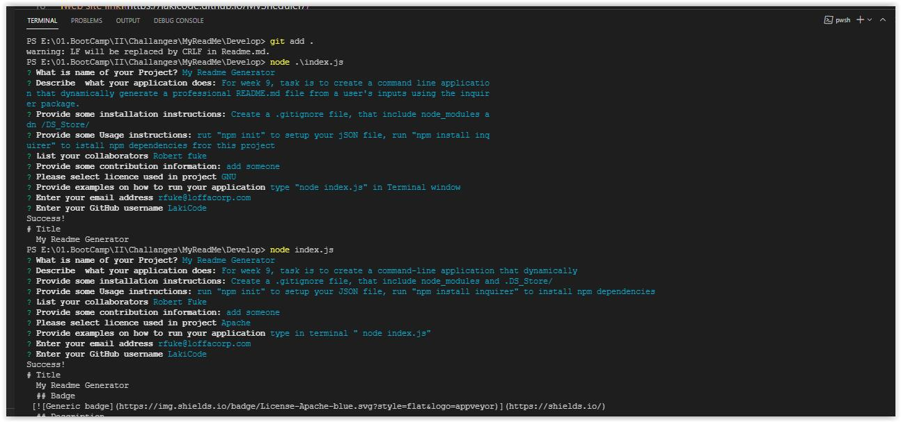

# Title 
  My Readme Generator
  ## Badge 
 
  ## Description 
 For week 9, task is to create a command-line application that dynamically 
generate a professional Readme.md file from a user's inputs using the Inquirer package.
  ## Table of Contents
  *  [Installation](#installation)
  *  [Usage](#usage)
  *  [Credits](#credits)
  * [License](#license)
  ## Installation 
 Create a .gitignore file, that include node_modules and .DS_Store/
  ## Usage 
 run "npm init" to setup your JSON file, run "npm install inquirer" to install npm dependencies
  ## Credits 
 Robert Fuke
  ## License 
  https://choosealicense.com/licenses/apache-2.0/
  ## Contribution 
 add someone
  ## Test 
 type in terminal "node index.js"
  ## Questions
  ### GitHub 
 link to my GitHub profile 
 https://github.com/LakiCode
  ### Contact 
 For any additional questions, please contact me over a Email. 
 My email address is: 
 rfuke@loffacorp.com
## App screenshots

<a href="https://drive.google.com/file/d/1mJwMRflS8mz9ZYLJP05_hK_he0M2pDT0/view" target="_blank">My Readme Gerenrator in action</a>
